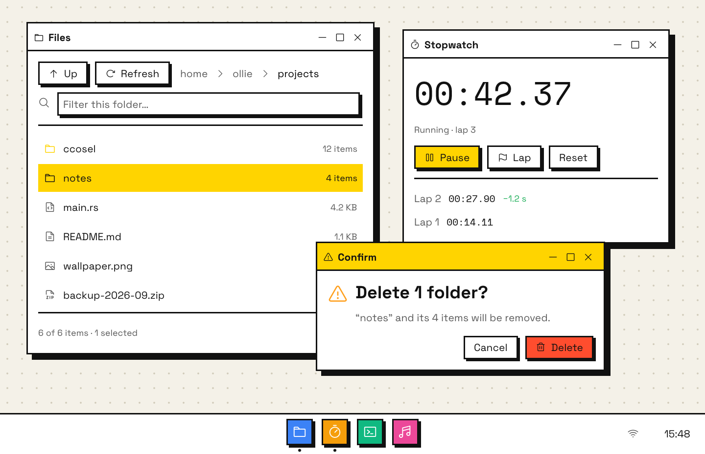
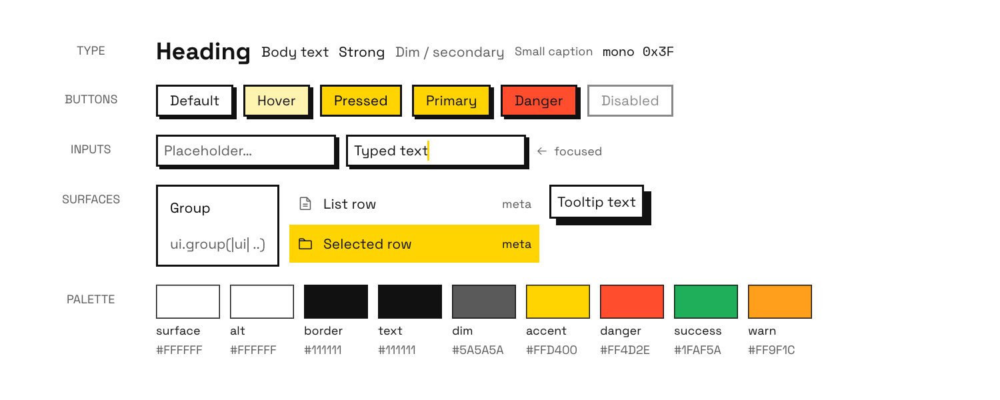

# Brutal

**Loud, flat, confident.** Black 2 px outlines, hard offset shadows with no blur, a
highlighter-yellow accent, a dotted cream desktop and Space Grotesk. It's unapologetically
graphic and very legible, and it photographs well. Every element has an obvious edge, which
also makes it the easiest style to keep consistent. Light only.




## Tokens

| Token | Value | Used for |
|---|---|---|
| `surface` / `surface_alt` | `#FFFFFF` / `#FFFFFF` | windows / widgets |
| `hover` | `#FFF3B0` | hovered widget (pale yellow) |
| `border` = `border_strong` = `text` | `#111111` | ink |
| `text_dim` | `#5A5A5A` | `weak` |
| `accent` / `on_accent` | `#FFD400` / `#111111` | primary, pressed, selection, active title bar |
| `danger` · `success` · `warn` | `#FF4D2E` · `#1FAF5A` · `#FF9F1C` | status, danger button fill |

> **Wallpaper:** keep the existing one (`background.rs`, `/wallpaper.jpg`). The dotted cream
> background in the renders is only there for the mockup.

## Shape, type, spacing

- **Radius 0, stroke 2 px**, everywhere, all the same ink.
- **Window shadow:** `offset [7,7] blur 0 spread 0`, solid `#111111`. egui's `Shadow` does this
  natively.
- **Button shadow:** 3 px, same ink. It's painted behind the button (see below). A pressed
  button loses its shadow, so it looks pushed in.
- **Type:** **Space Grotesk 400** body 14 / small 12; **Space Grotesk 700** heading 24 and titles;
  **Space Mono** 13.
- **Spacing:** item `10×10`, button padding `14×7`, window margin 14.

## The button shadow (the one custom painter)

Reserve a shape slot before adding the widget, then fill it once the rect is known. That's the
standard egui trick for painting *behind* something:

```rust
let slot = ui.painter().add(egui::Shape::Noop);
let r = ui.add(button);
if !r.is_pointer_button_down_on() && r.enabled() {
    ui.painter().set(slot, Shape::rect_filled(r.rect.translate(vec2(3.0, 3.0)), 0, INK));
}
```

The same applies to text edits. In `replay.rs` it wraps the `Cmd::Button` and
`Cmd::TextEditSingle` arms.

## Chrome

- **Title bar (38 px):** the active window is filled `accent` yellow and the inactive one
  white; ink icon, bold title, ink `– □ ×`, 2 px ink rule underneath.
- **Dock:** white bar, 2 px ink top rule, square app badges in their own colours with an ink
  outline and a 3 px hard shadow.

## Style-specific rules

- Yellow means "this one": the active window, the selected row, the primary button, the pressed
  state. The one other use is the line of a graph, which is a mark rather than text. Nothing
  else is yellow.
- Links are ink and underlined, never yellow: yellow text on white is about 1.4:1, far below the
  4.5:1 that text needs. The underline is what marks them as links.
- Selection is solid yellow with ink text. It never tints.
- Only the danger button uses a colour other than yellow.
- Headings are big (24) and bold. Hierarchy comes from size and weight, not colour.

## Tokens in Rust

```rust
fn brutal() -> Tokens {
    let ink = hex(0x111111);
    Tokens {
        dark: false,
        surface: Color32::WHITE, surface_alt: Color32::WHITE, hover: hex(0xFFF3B0),
        border: ink, border_strong: ink,
        text: ink, text_dim: hex(0x5A5A5A),
        accent: hex(0xFFD400), on_accent: ink,
        sel_bg: hex(0xFFD400), sel_fg: ink,
        danger: hex(0xFF4D2E), success: hex(0x1FAF5A), warn: hex(0xFF9F1C),
        r_window: 0, r_widget: 0, stroke: 2.0,
        shadow: Shadow { offset: [7, 7], blur: 0, spread: 0, color: ink },
        body: 14.0, heading: 24.0, small: 12.0, mono: 13.0,
        pad: vec2(14.0, 7.0), spacing: vec2(10.0, 10.0), margin: 14,
    }
}
// plus: widgets.active fill = accent (pressed = yellow); button hard shadow 3 px
// links: hyperlink_color = ink, underlined; graph lines: accent (ccosel_host::set_plot_color)
// fonts: body = Space Grotesk 400, heading = Space Grotesk 700, mono = Space Mono 400
```
